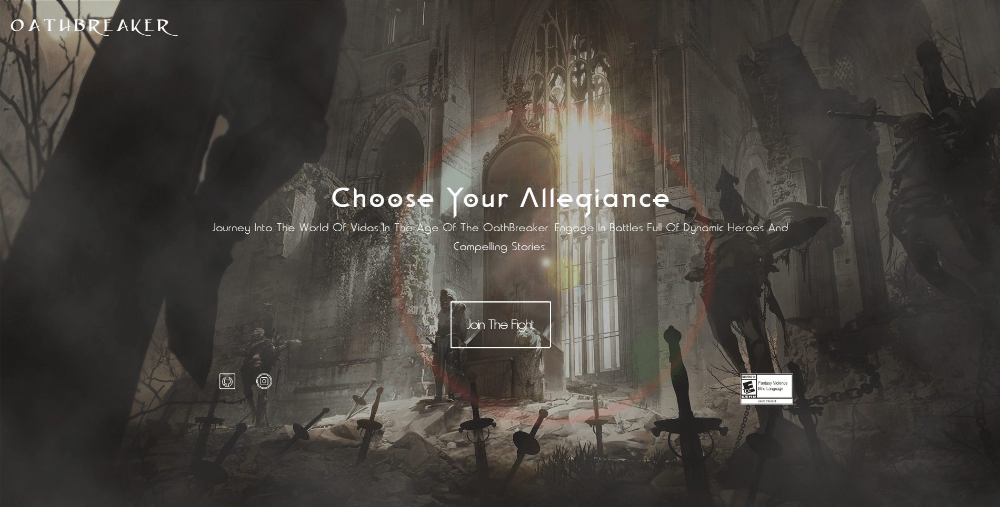
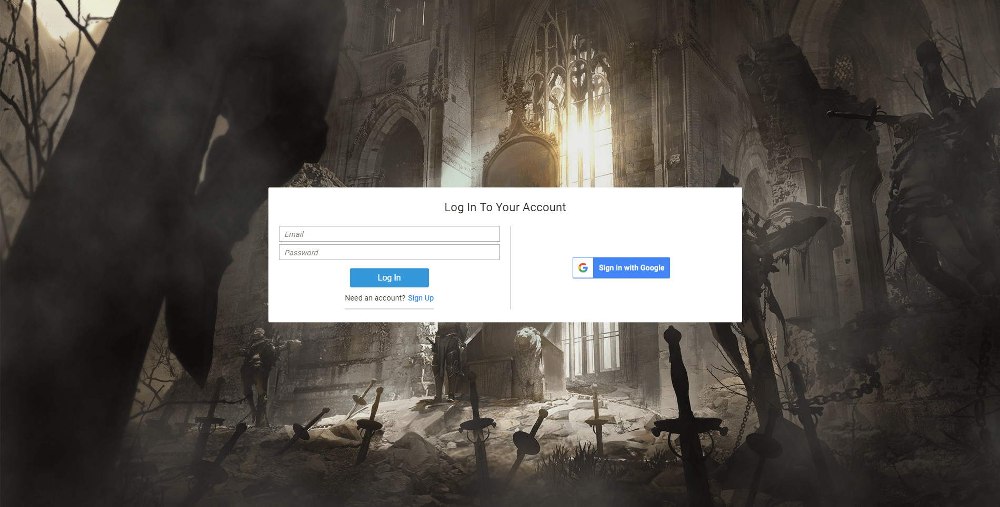
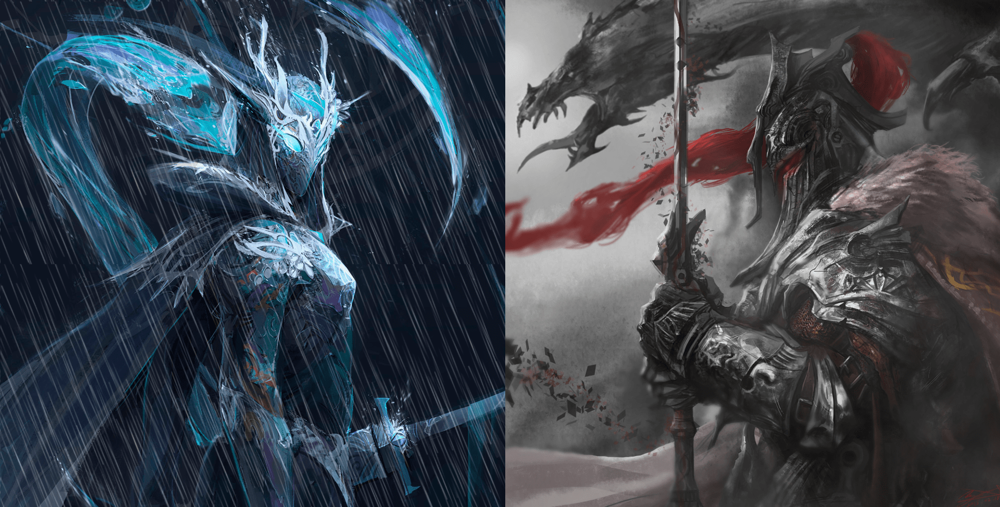
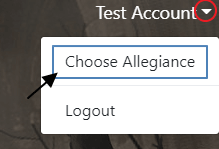
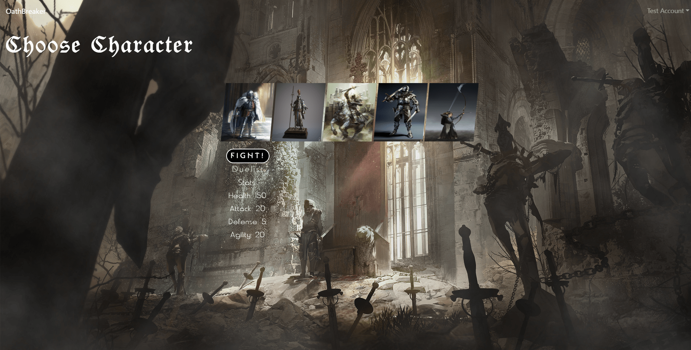

# OathBreaker



[Deployed Project](https://oathbreaker.herokuapp.com/)

## Project Description

---

OathBreaker is a fantasy medieval-themed fighting game. Users can signup/login by creating an account or using Google.



A local login account has been created for your convenience should you opt for the local login method:

```
email: test@example.com
password: test123
```

Once you are logged in, you will be presented with the faction page:



OathBreaker has two factions - The Triumvate which is represented by the element of water (left) and The Vjarr which is represented by the element of fire (right).

You will always have a chance to switch your faction at any point during the game (hence the name OathBreaker). This can be done with the navbar on the next page:



Once a faction has been selected, you are then presented with characters belonging to your particular faction and can choose any one of them as your character to fight against a randomly selected character from the opposing faction.



Upon selecting your character, the battle begins!


### Contributors

---

- [Roman Senin](https://github.com/romansenin)
- [Phillip Booker](https://github.com/phillipbooker)
- [Loren Brown](https://github.com/viveleloren)
- [Paige Smith](https://github.com/paigesmith3794)

#### Technologies

---

MongoDB, Express, React, Node, CSS3, & Passport
